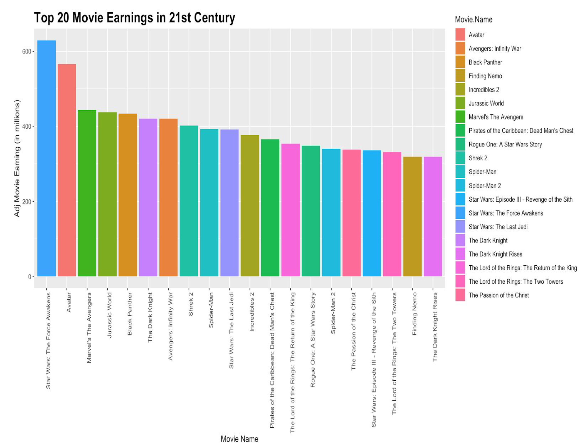

# Movie-Analysis
Movies are becoming an important part of life. In the age of digital world, studying its role and impact on society is a challenging task. It entertains people and influence them and at the same time it also helps to make profit for film companies which motivates them to create more movies for people.
# Data Set
Data is collected by web scraping using Rvest, omdbapi(independent package) in R from various movie websites such as IMDB Omdbapi, Rotten Tomato, Box Office Mojo & National Association of Theatre Owners etc. and saved into csv format.

# Data Wrangling
Data Preprocessing in an important data mining step used to convert raw data to usable format. Often data is inconsistent with missing values, and contains many errors.
   Some of the steps taken for this dataset:
    * Type Adjustment
    * Handling missing Values
    * Hot encoding
    * Merging
    * Inflation adjustment
    
# Data Exploration and Findings
I was able to find Top Earning movies of 21st Century (i.e. 2001-2018), Highest Earning Studio, Highest Earning Genre, Average runtime for movies for each studio, Highest Earning Rating for the movies, Biggest Opening day earner of the 21st Century etc which gave us meaningful insights about the movies.

# Visualizations:
 Couple of visualizations are done to process the information easily and fast. One of the example is:
 
 

# Future work:
1. More websites can also be added like Netflix.com, popcornflix.com etc which can add more details about movies.
2. I can add actors, actresses with directors too because movie box office can also be influenced by the combination of actors and directors.
3. Rather than top 100 movies, analysis could be extended for all movies.
4. Budget of the movie is also an influential factor.
5. Season can also be considered as important factors as most of the successful movies are released during the summer or winter break.
6. Critic opinion can also be considered as it is also one of the factor of earning. Tomatometer and Tomato User meter are critics and user rating and it wassurprising to observe that both had a similar effect, which mean audience still agree with the critics opinions.
